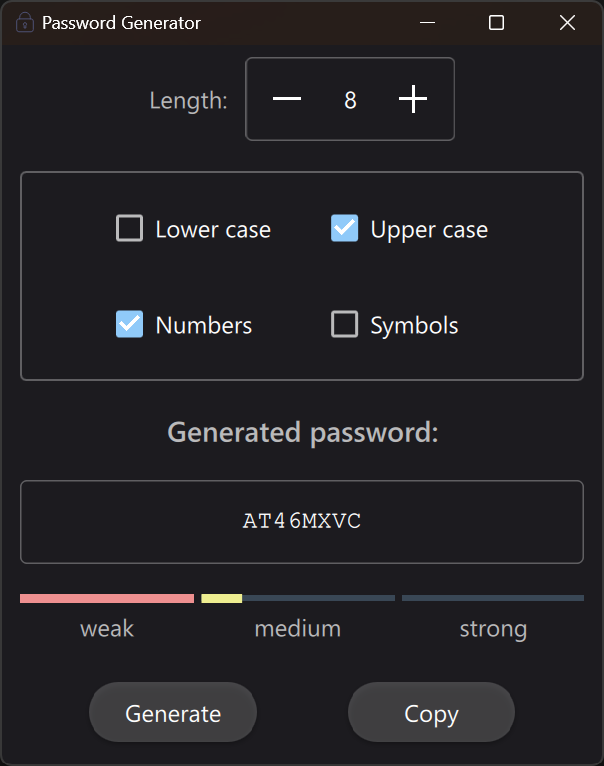
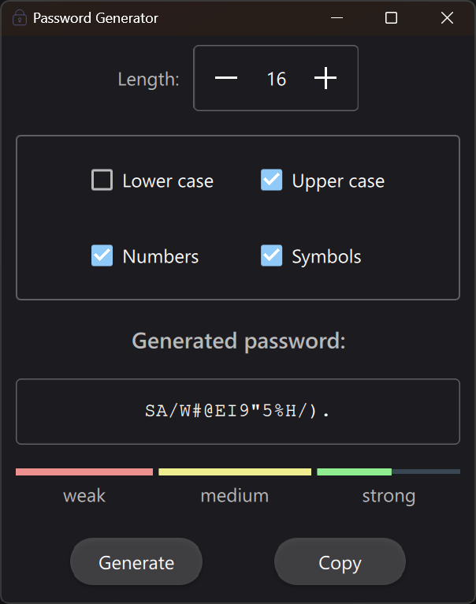

# Password Generator

Lightweight QML password generator using Qt Quick.

The generated password text box can be edited to check the robustness of any manual entered password.

## Screenshots

| | |
|-----|-----|
 | 

## Notes for Qt / QML applications

- To make .qrc resource files work, it is necessary to add `set(CMAKE_AUTORCC ON)` inside CMakeLists.txt before the `qt_add_executable` line.
- To set the application icon (the application icon seen in windows explorer) it is necessary to crete a Windows resorce file with the `.rc` extension:
  - Create a .ico file from the dessired application icon.
  - Create the `.rc` file and set the icon and other properties. See [PassGenerator.rc](/resources/PassGenerator.rc) for details.
- To import custom `.qml` modules / files you can simply import the relative path like `import "./resources"`. All QML components defined inside each `qml` files should be available.
